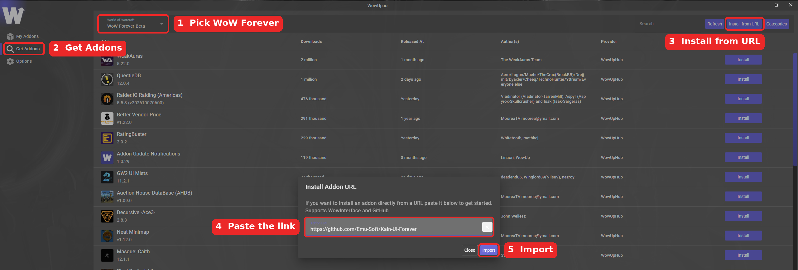

  

<h1 align="center">K-UI: Forever</h1>

  Edit Mode+ for <b>World of Warcraft: Forever</b>. 

  <a href="../../releases/latest"><b>Download the latest release</b></a> &nbsp;·&nbsp; <a href="#with-wowup-recommended"><b>Install with WowUp</b></a>

---

## Installing

### With WowUp (recommended)

[WowUp](https://wowup.io) installs the addon for you and keeps it up to date.

1. Open WowUp and pick **WoW Forever** in the game dropdown at the top left.
2. Click **Get Addons** on the left, then **Install from URL** at the top right.
3. Paste `https://github.com/Emu-Soft/Kain-UI-Forever` into the box and click **Import**.
4. Restart the game (a `/reload` isn't enough the first time), then type `/kui` to open the settings.

From then on, WowUp shows an update whenever a new version is released.

### Manually

1. Download the **Kain-UI-Forever** zip from the [latest release](../../releases/latest).
2. Unzip it. You'll get a folder called `Kain-UI-Forever`.
3. Put that folder in your WoW: Forever `Interface\AddOns` folder. The folder name must stay exactly `Kain-UI-Forever`.
4. Restart the game (a `/reload` isn't enough the first time), then type `/kui` to open the settings.

To update, replace the `Kain-UI-Forever` folder with the one from the newest release. Your settings are kept.

## Getting started

Every option starts switched off on a new character, so you only get the changes you choose.

- **Kain's preset** sets every option the recommended way in one click.
- **Import Kain-UI Profile** sets up the recommended screen layout and switches on the extra action bars.

Hover the small **i** icons in the settings to read what an option does. The blue gem in the bottom-left corner opens the patch notes, and the version you're running is shown in the bottom-right corner.

## Features

### Tooltips
- **Grow Right**: tooltips always appear in the same spot and grow to the right, so they don't jump around or cover things. Unlock the anchor to choose the spot.
- **Cast By**: buff and debuff tooltips show who cast them, in the caster's class colour. Works on you, your target and your party, and remembers the caster after they've left, gone out of range, or you've taken a boat.
- **Wowhead search**: hover an item, spell or quest (including links in chat) and press **Ctrl+Shift+W** to get a Wowhead search link, ready to copy. Change the key under *Key Bindings > AddOns > K-UI: Forever*.

### Chat
- **Enhance Chat**: timestamps, short channel names like `[1]`, clickable web links, a copy-chat button, hidden scroll bars, and the Up arrow to bring back messages you've sent. These pause inside dungeons and raids so chat always keeps working.
- **Emoji**: type codes like `:smile:` or pick one from the face button by the chat box. Over 1,500 to choose from.
- **Movable social button**: drag the friends button anywhere; friend pop-ups follow it.
- **Recent Allies notes**: right-click someone in Recent Allies and choose *Set Note*. All your characters can see it.

### Minimap
- **Square Minimap** with a metal border and soft inner shadow.
- **Minimap button box**: addon minimap buttons are tidied away; right-click the minimap to open them (with Square Minimap).
- **Detach and unlock minimap elements**: split off the zone bar, and move the mail icon, day/night indicator and difficulty badge.
- Let the minimap sit partly off the edge of the screen.

### XP bar
- **XP bar under your portrait**, with a gold marker where rested XP starts, and the option to hide Blizzard's.
- **XP per hour**: hover the bar and hold **Shift** to see XP per hour (killing, with travel, from quests), an estimate, and time to level.
- **Screenshot on level up**: a screenshot of every milestone, saved to your Screenshots folder.

### Windows, bags and loot
- **Global Dragging**: move the Character, Spellbook, Talents, Map, Quest Log, bags, professions, vendor, Social and more by their title bar.
- **Fast loot**, and **draggable loot roll windows** that never end up off-screen.
- Hide any **bag slot** (keyring included) and the bag bar's background art.
- Hide any **micro menu** button, or the whole menu.
- **Vendor**: auto-sell greys and auto-repair, optionally with guild funds.

### Questing
- **K-Key**: talk to NPCs from the keyboard. Number keys pick options and rewards; Space accepts quests and moves the text along.
- **K-Targeter**: one macro that always targets whatever your tracked quest needs next.
- **Quest item sparkles**: things you need for a quest sparkle so they're easy to spot.
- **RestedXP Guides tweaks**: guide arrow distance in metres, and hide Blizzard's quest tracker while the guide is showing.

### Graphics, camera and nameplates
- **Contrast**: recommended contrast and brightness, with a button to restore yours.
- **Weather intensity** and **max zoom distance** sliders.
- **Plater style** nameplates. Untick to get your own settings back.

### Macros
- **Weapon Swap Macro Helper**: drag your weapons into the slots at the top of the settings for a one-click swap macro.
- **Macro icon names**: hover any macro icon to see its name, or search icons by name.
- **Starter macros**: coin flip, skull and cross raid markers, and a guild inviter.

### Layout
- **Snap to elements**: things you move snap into line, with an alignment grid while you arrange.

## Commands

`/kainui` works anywhere `/kui` does. Type `/kui help` in game for this list.

| Command | What it does |
|---|---|
| `/kui` | Open the settings. |
| `/kui help` | Show the list of commands. |
| `/kui snapshot` | Everything needed for a bug report: your settings, any errors from this addon, and your other addons. |
| `/kui clearerrors` | Empty the list of errors in `/kui snapshot` (after you've sent it). |
| `/kui resetdrag` | Put windows you've dragged back where they started. |
| `/kui resetlootroll` | Put loot roll windows back in their normal place. |
| `/kui zonebarreset` | Put the zone bar back in its starting spot. |
| `/kui xpreset` | Start counting XP per hour again (handy after a break). |
| `/kui installmacros` | Add the starter macros again. |
| `/kui weaponswap` | Rebuild the weapon swap macro. |
| `/kui linksoff` | Switch Enhance Chat off straight away, if chat ever misbehaves. |
| `/kui factoryreset confirm` | Erase all of this addon's settings and start fresh. Can't be undone. |
| `/kainuiemoji on` / `off` | Show or hide emoji in chat. |
| `/kainuiemoji list` | List every emoji code you can type. |
| `/kkey` | K-Key options. |
| `/kt` | K-Targeter options. |
| `/rl` | Reload your interface. |
| `/flip` (or `/coin`) | Flip a coin as an emote. Target someone first to flip for them. |

| Key | What it does |
|---|---|
| **Ctrl+Shift+W** | Wowhead search for the item, spell or quest under your mouse. |

## Why some things work differently on WoW: Forever

WoW: Forever runs on Blizzard's newest game client, and that client hides some information from addons. Blizzard calls these **secret values**. The game still shows them to you, but an addon can't read them, and an addon that even checks one gets an error. This mostly happens **in combat** and **inside dungeons and raids**. Blizzard also has older rules that stop addons from changing parts of the screen during combat.

Every feature below has been changed to work around this. Where something can't be done, the addon leaves it alone rather than guess or cause errors.

| Feature | What you might notice | Why, and what we did about it |
|---|---|---|
| **Cast By** | A buff someone puts on you **while you're in combat** has no "Cast By" line, even after the fight. | The game hides who cast a buff during combat and never tells addons afterwards. Buffs cast outside combat are remembered as they land, so the name stays after the caster leaves, after a /reload and across loading screens. |
| **Cast By** (dungeons and raids) | Some buffs and debuffs show no caster inside instances. | Caster names are often hidden there. The addon shows a name only when it's sure, and never guesses. |
| **Combat log** | No feature reads the combat log. | WoW: Forever doesn't give addons the combat log at all (we tested it in game). Anything that would have needed it, like K-Targeter counting your kills, uses the quest log or loot window instead. |
| **Tooltip health bar** | Inside instances the health text can show just numbers or a "?", with no percentage. | Health can be a secret number, and addons can't do maths on secret numbers. The addon hands the values straight to the game to draw, which it's allowed to do. |
| **Tooltip extra lines** (guild, level, talent spec) | Sometimes missing, mostly in combat or inside instances. | The tooltip's own lines can be hidden from addons, so the addon can't tell what's already there. It skips the extra line rather than risk adding it twice or causing an error. |
| **Enhance Chat** (timestamps, short channel names, web links) | These pause inside dungeons and raids, so chat looks like Blizzard's normal chat there. | Changing chat while names and messages are secret broke chat completely in early tests: messages stopped appearing mid-fight. Lines that were changed before you went in stay changed. |
| **Emoji** | Emoji codes like `:smile:` show as plain text inside dungeons and raids. | Same reason as Enhance Chat. They work again as soon as you leave. |
| **Emoji picker** | During boss fights in new content, picking an emoji won't open the chat box for you. | The game blocks sending any message an addon has touched during those fights. Open chat with your own key instead. |
| **Group Finder zone names** | Sometimes blank inside dungeons and raids. | The zone name can be secret there, so the addon leaves it out. |
| **K-Targeter** | Can pause in some restricted areas, and never names a target the game hides. | Zone and unit names can be secret. The macro only gets names the addon can read for sure. |
| **K-Key** | Doesn't work in a few protected boxes, like the money boxes in the Trade window. | Those boxes are completely off-limits to addons, so K-Key steps back and lets you type normally. |
| **Global Dragging** | Some windows can't be moved during combat, and a window you open may settle into its spot a split second late. | Blizzard locks protected windows in combat. Moving a window at the exact moment the game opens it caused errors in the Character window, so the move happens just after. |
| **Import Kain-UI Profile** (extra action bars) | Extra action bars may need a `/reload` before they appear. | Showing action bars directly from an addon can break them, so the addon switches them on and lets the game show them cleanly after a reload. |
| **XP bar and micro menu** (hiding Blizzard's) | If you change these in combat, the change happens when combat ends. | Those bars are locked during combat. The addon waits and does it straight after. |
| **Weapon Swap Macro Helper** | Changing your weapon slots in combat updates the macro when combat ends. | Addons can't edit macros in combat. The swap itself still works in combat, because it's a normal macro. |
| **Presets and nameplate settings** | Can't be applied during combat. | Blizzard locks these settings in combat. Try again once you're out. |
| **RestedXP Guides tweaks** | Blizzard's quest tracker turns invisible while the guide shows, instead of folding up. | Folding the tracker up from an addon caused errors in combat. Making it invisible doesn't. |
| **Draggable loot roll windows** | The preview of where rolls will appear only shows after you've seen one real loot roll. | A fake roll would run the game's loot code on made-up data and cause errors, so the preview waits for a real one. |
| **`/kui snapshot`** | Some values in a report show as `<secret>`. | The addon can't read those values, so it never tries to copy them into a report. |

If something here stops you doing what you need, or you spot a limitation that isn't listed, see the section below.

## Reporting a problem

1. Type `/kui snapshot` in game. A window opens with everything needed to look into it: your settings, any errors the addon has run into (with where you were at the time), your game version and your other addons.
2. Press **Ctrl+C** to copy it, and paste it into your report along with a few words on what happened.
3. Once it's sent, `/kui clearerrors` empties the error list so the next report starts fresh.

No extra addon is needed. If you use BugSack, its errors from this addon are included too.
